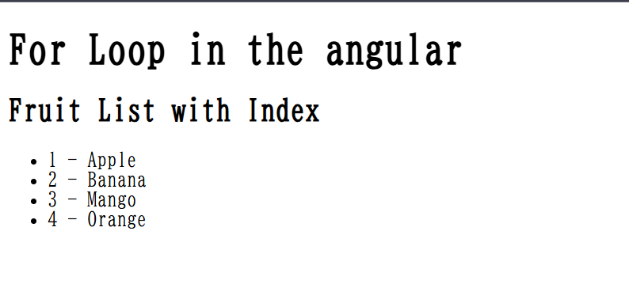

# Angular `@for` — Modern Loop Syntax (Angular 17+)

This README provides a brief overview of Angular’s modern `@for` loop syntax introduced in Angular 17 and supported in Angular 18 and 19.

---

## 📘 Overview

`@for` is a new control flow block used to iterate over items in a list directly within the template. It offers a clean and readable syntax for displaying repeated elements.

---

## ✅ Key Features

- Uses a block-based structure.
- Loop variables like `index`, `first`, `last`, and `even` are supported.
- Makes template code more structured and easier to follow.

---

## 🔄 Compatibility

- **Angular 17:** Available when enabled in configuration.
- **Angular 18+:** Enabled by default.
- **Angular 19:** Fully supported.

---

## 🛠️ Usage Notes

- Use `@for (item of items)` to loop through arrays or iterable values.
- Works naturally with both static and dynamic lists.
- Supports inline conditions inside the loop if needed.

---

## 🖼️ Demo Screenshot

