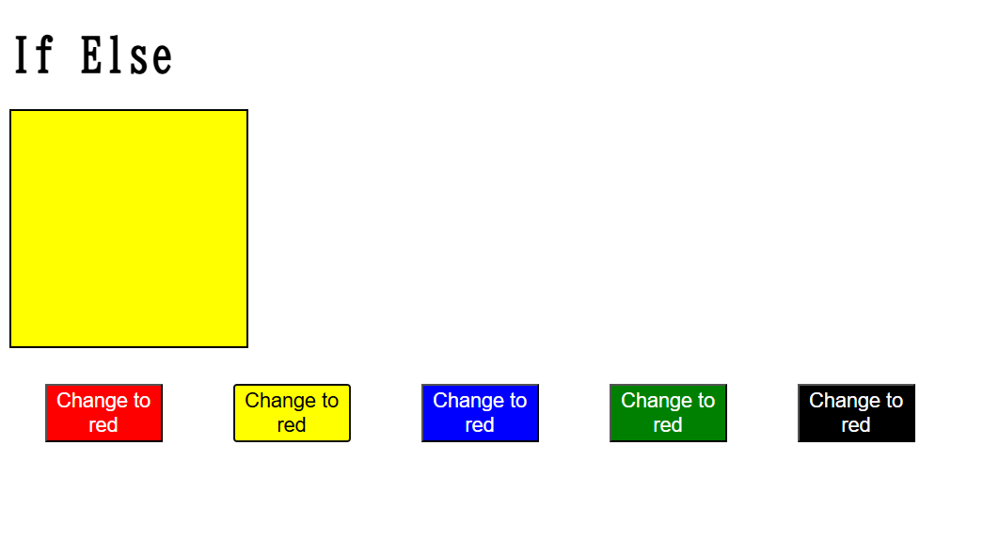

# Angular `@if` and `@else` — Modern Control Flow (Angular 17+ / 18 / 19)

This README provides a quick explanation and demo of Angular’s modern control flow syntax using `@if` and `@else`, supported in Angular 17 and above.

---

## 📘 What is `@if`?

Angular’s `@if` syntax is the modern alternative to the traditional `*ngIf` directive. It makes the template code cleaner and avoids the use of `ng-template`.

`@else` is used alongside `@if` to define a fallback block when the condition is false.

---

## ✅ Key Points

- `@if` replaces `*ngIf` for conditional rendering.
- `@else` replaces `else` with `ng-template`.
- Easier to read, especially with nested logic.
- Available by default in Angular 18+.
- In Angular 17, it must be enabled explicitly.

---

## 🧪 Demo

A component renders one of two messages based on a Boolean condition:

- If the user is logged in, it displays:  
  **✅ Welcome back, user!**

- If the user is not logged in, it displays:  
  **❌ Please log in to continue.**

You can toggle the `isLoggedIn` variable in the component to test both outcomes.

---

## 🛠️ Setup (if using Angular 17)

To use `@if` in Angular 17, enable the new control flow syntax in the compiler settings or via standalone component setup.

From Angular 18 onward, no extra configuration is needed.

---

## 🚀 Compatibility

- ✅ Angular 17 (requires enabling control flow)
- ✅ Angular 18 (enabled by default)
- ✅ Angular 19 (fully supported)

---

## 📌 Note

Use `@if` for simpler, cleaner templates. It reduces boilerplate and improves readability over the traditional `*ngIf` + `<ng-template>` approach.

---

## Demo

