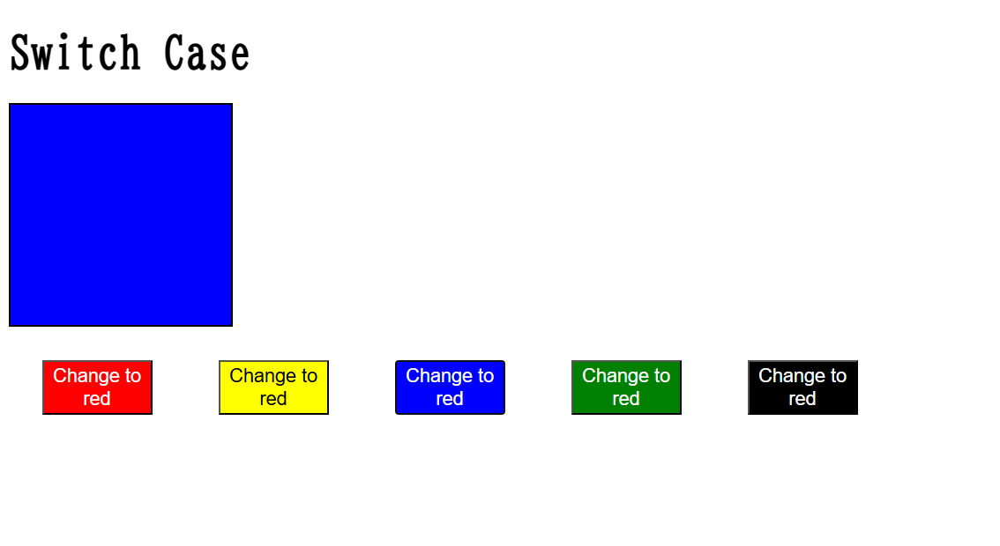

# Angular `@switch`, `@case`, and `@default` — Modern Control Flow (Angular 17+)

This README provides a basic overview of Angular’s modern `@switch` control flow syntax, introduced in Angular 17 and continued in Angular 18 and 19.

---

## 📘 Overview

Angular’s new control flow syntax introduces `@switch`, `@case`, and `@default` as a cleaner alternative to the traditional `ngSwitch`, `ngSwitchCase`, and `ngSwitchDefault`.

---

## ✅ Key Features

- `@switch` replaces `ngSwitch`.
- `@case` replaces `ngSwitchCase`.
- `@default` replaces `ngSwitchDefault`.
- More intuitive, readable, and similar to regular JavaScript `switch-case`.

---

## 🔄 Compatibility

- **Angular 17:** Optional — must be enabled via configuration.
- **Angular 18+:** Enabled by default.
- **Angular 19:** Fully supported and recommended.

---

## 🧠 Benefits

- Modern, block-based syntax with better readability.
- No need to rely on structural directives.
- Easier to follow and write nested switch-case logic.

---

## 🛠️ Usage Notes

- Available only in Angular 17 and above.
- In Angular 17, you need to explicitly enable the new control flow.
- From Angular 18 onward, it is available by default.

---

## 📌 Reminder

This new syntax offers significant improvements in clarity and maintainability over the old `ngSwitch` system. If you're using Angular 17, make sure to enable it in your build or standalone app setup.

---

## 🖼️ Demo Screenshot

